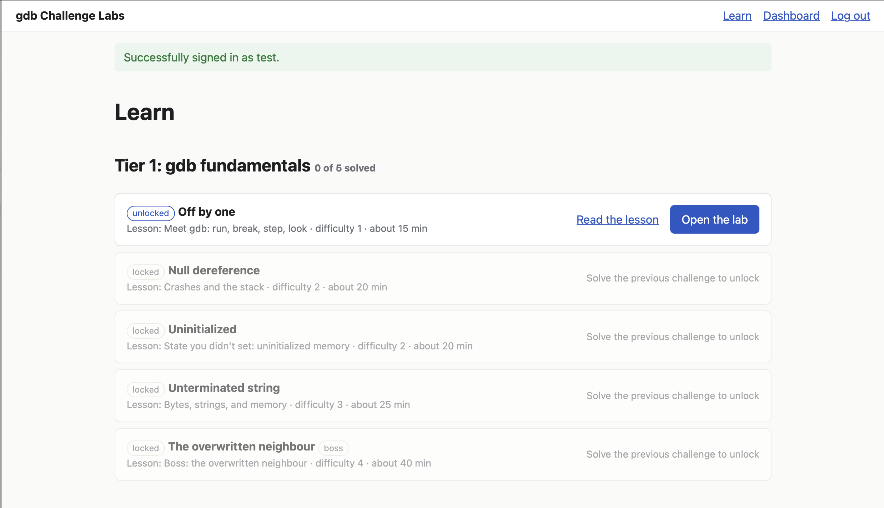
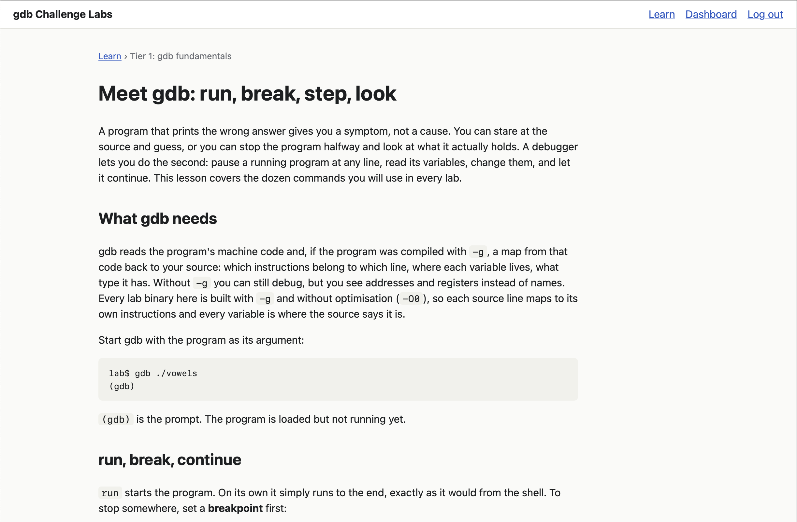
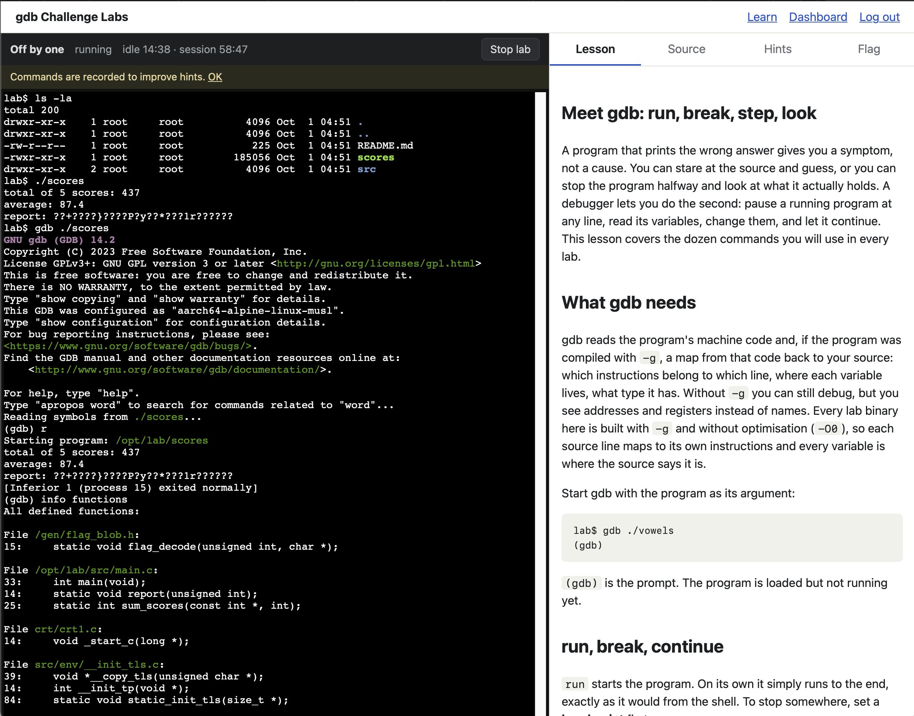
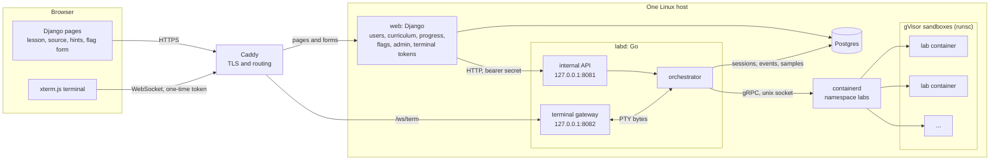
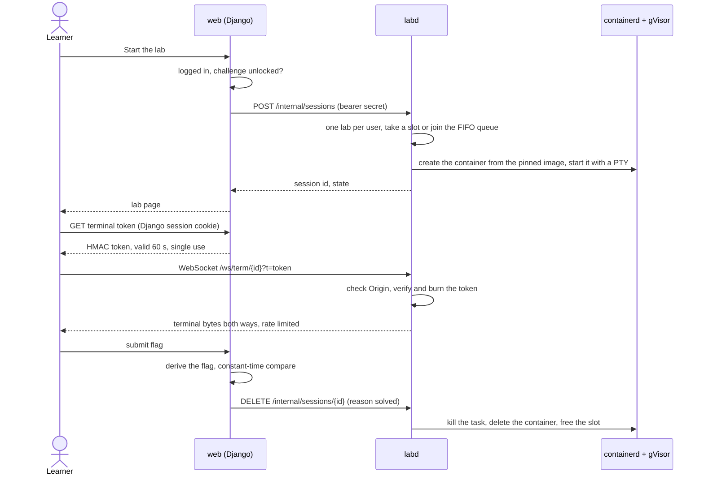
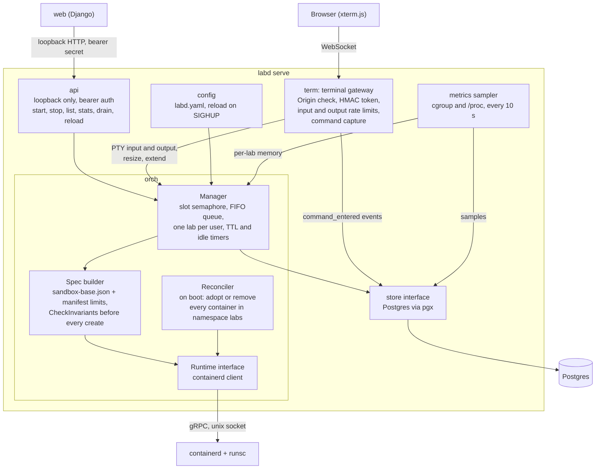

> **Why I built this.** Tech education sites hand you a real shell in a browser tab, and I wanted to know how they do it. What runs behind that terminal? How do you let strangers type into a shell on your server without handing them the server? This project is my answer, built end to end as a proof of concept and a template. It is not deployed anywhere.
>
> My second goal was to write a thin container orchestration layer in Go and test it properly. No Kubernetes and no Docker daemon: one Go service that talks to containerd, keeps every lab in a gVisor sandbox with hard limits, and cleans up after itself. Then I measured what a lab really costs. On an 8-CPU machine it held 150 concurrent labs with every limit met ([docs/metrics/vps-capacity.md](docs/metrics/vps-capacity.md)).

# gdb Challenge Labs

A web platform where developers learn gdb by debugging real bugs in sandboxed (gVisor) containers from the browser and submitting CTF-style flags.

- How the app is defended: [SECURITY.md](SECURITY.md).
- Where the project is right now: [docs/STATUS.md](docs/STATUS.md).
- The plan: [docs/plan/IMPLEMENTATION_PLAN.md](docs/plan/IMPLEMENTATION_PLAN.md).
- The spec: [docs/spec/mvp-spec.md](docs/spec/mvp-spec.md).
- Working with an AI assistant or starting a session: read [CLAUDE.md](CLAUDE.md).

## What it looks like

The Learn page. Tier 1 has five labs, and each one unlocks when you solve the one before it.



Every lab has a lesson that teaches the gdb commands it needs.



The lab itself. On the left is a real shell inside a gVisor sandbox, here running gdb on lab 1's binary. On the right are the lesson, the read-only source, the hints and the flag form.



## Architecture

Four processes on one Linux box. `web` (Django) owns users, the curriculum, progress and flags. `labd` (Go) owns the labs: it starts and stops containers and bridges each one's terminal to the browser. containerd runs the containers under gVisor (`runsc`), and Postgres holds all durable state. Only `labd` can reach the containerd socket, and only `web` talks to users.



Caddy and the production systemd units are designed in the spec but not built, because I stopped before the optional deployment phase. In development there is no Caddy: Django serves port 8000 and the browser opens the WebSocket on labd's port 8082 directly.

Starting a lab, using it, and solving it:



### Inside labd

`labd` is one Go binary. The terminal gateway and the orchestrator are separate packages in the same process, so a keystroke reaches the lab without another network hop. Every outside dependency sits behind an interface: the tests run the orchestrator against a fake runtime, an in-memory store and a fake clock, and a separate integration suite runs it against real containerd.



| Package | Job |
| --- | --- |
| [labd/internal/orch](labd/internal/orch) | Session lifecycle, the concurrency cap and queue, timers, the boot reconciler, and the OCI spec builder. The only package that imports containerd |
| [labd/internal/term](labd/internal/term) | The WebSocket to PTY bridge: token check, rate limits, resize, command capture ([protocol](labd/internal/term/README.md)) |
| [labd/internal/api](labd/internal/api) | The internal HTTP API. It refuses to listen on anything but loopback |
| [labd/internal/metrics](labd/internal/metrics) | Samples cgroup and `/proc` numbers per lab and for the host |
| [labd/internal/store](labd/internal/store) | Postgres access and the embedded SQL migrations |
| [labd/sandbox](labd/sandbox) | `sandbox-base.json`, the OCI spec every lab starts from, compiled into the binary |

[labd/README.md](labd/README.md) has the full package map.

## Quick start: build and run on a fresh machine

At the end of these steps you have the whole app on your machine: Django at http://127.0.0.1:8000, labd behind it, and the five tier-1 labs. You sign up, start lab 1, and debug it with gdb in the browser terminal.

Every command runs from the repo root. On macOS, `run.sh` runs the Linux parts (containerd, labs, labd, Django) inside a Lima VM for you, so the commands are the same on both systems.

**Shortcut:** `make lab-up` checks every step below in order and starts the app when they all pass. When one fails, it stops and prints the command to run, so on a fresh machine you can run it, follow what it says, and run it again. `make lab-down` stops the app. The steps below explain what each check needs.

| Host | Labs run under | Notes |
| --- | --- | --- |
| Linux x86-64, Ubuntu 24.04 or another Debian/Ubuntu | gVisor (`runsc`), as in production | The reference setup. `vm up` installs system services on this machine with sudo |
| macOS, Apple Silicon | `runc` inside an arm64 Lima VM | gdb under gVisor on arm64 cannot resume from a breakpoint ([QUESTIONS Q13](docs/QUESTIONS.md)), so the Mac uses runc. Fine for trying the app; not for measurements |
| Windows | not supported | Use a Linux machine or VM |

### 1. Install the prerequisites

**Linux** (Debian/Ubuntu family; Fedora and Arch are not supported):

```
sudo apt-get update
sudo apt-get install -y git make curl
```

Then install Docker Engine (https://docs.docker.com/engine/install/ubuntu/, or `sudo apt-get install -y docker.io`). Docker is used only to build the lab images. Install it **before** step 3: `vm up` runs its own pinned containerd, and Docker keeps working on it. Optional: `sudo usermod -aG docker $USER`, then log out and back in. Without it, the image scripts ask for sudo instead.

You don't need to install Go, uv, jq, shellcheck or Postgres yourself: `./run.sh vm up` installs them in step 3.

**macOS:**

```
xcode-select --install                      # git, make, curl
brew install go uv lima jq shellcheck
```

Then install Docker Desktop (https://www.docker.com/products/docker-desktop/) and start it. It must be running whenever you build images.

### 2. Clone and check the machine

```
git clone <repo-url> labbing-platform
cd labbing-platform
./run.sh doctor
```

`doctor` prints what is installed, what is missing, and the command that installs each missing item. On a fresh Linux machine it lists Go, uv and containerd as missing until step 3; that is expected. On macOS, install anything it lists before going on.

### 3. Set up the lab runtime

```
./run.sh vm up        # Linux: installs containerd, gVisor, Postgres 16, Go, uv (sudo asks once)
                      # macOS: creates and provisions the Lima VM (the first run downloads Ubuntu)
./run.sh vm verify    # must print "runsc ok" and "cgroup2fs"
./run.sh check        # every required dependency is present: exits 0
```

`vm up` is safe to run again. Run it after any pull that changes `deploy/scripts/provision.sh`.

### 4. Build labd and the images

```
./run.sh build        # labd and labd-perf
./run.sh images all   # the gcc build image, the labbase image (Alpine + gdb), the perf image
```

Then build the five tier-1 labs. Each build compiles the bug twice, checks that the two builds match, checks that the flag isn't in the binary, solves the lab with gdb in the sandbox, and imports the image into containerd:

```
for d in challenges/tier1-c-fundamentals/0*; do ./run.sh images challenge "$d" || break; done
```

Each lab ends with `dev image local/lab-<slug>@sha256:… recorded in .scratch/local-images.json`. Without that file, `web-stack up` refuses to start. The labs use the dev flag secret, which is fine on a dev machine.

### 5. Start the app

```
./run.sh web-stack up
```

This builds labd, starts it, loads your local lab images, migrates the dev Postgres, imports the challenges, and starts Django. It ends with:

```
==> up: http://127.0.0.1:8000 (sign up, open lab 1). Stop with: scripts/web-stack.sh down
```

Open http://127.0.0.1:8000 in your browser. On macOS the VM forwards the port to the Mac; if the first load fails, reload after a second or two.

1. Sign up with any email address. In dev, email verification is optional. If you want the link anyway, it is printed in `.scratch/web-stack/web.log`, not sent.
2. Go to `/learn`. Tier 1 shows lab 1 unlocked. Read the lesson, open the challenge, and press **Start the lab**.
3. The terminal opens in `/opt/lab`. Run the binary (lab 1: `./scores`), then debug it with `gdb`. Hints come one at a time on the page.
4. Paste the flag (`LAB{…}`) into the Flag tab. A correct flag stops the lab and unlocks lab 2.

To see the admin pages, make your account staff, then open http://127.0.0.1:8000/admin/live (running labs, a kill button, drain) and http://127.0.0.1:8000/admin/analytics/live:

```
./run.sh manage make_staff you@example.com
```

`./run.sh web-stack status` shows what is running. Logs are in `.scratch/web-stack/` (`labd.log`, `web.log`).

### 6. Stop the app

```
./run.sh web-stack down
```

This stops Django and labd, then removes any lab still running. Labs outlive labd on purpose, so always stop with `down` rather than killing processes. Your account and progress stay in Postgres for the next `up`.

### 7. Optional: run the tests

```
./run.sh test --all          # Go and Django unit tests
./run.sh lint
./run.sh test --integration  # against real containerd (in the VM on macOS)
./run.sh test --e2e          # brings the stack up, solves lab 1 in a headless browser, takes it down
```

The first `--e2e` on Linux needs a browser, installed once per machine: `(cd web && uv run playwright install --with-deps chromium)`.

### When something goes wrong

| Message | Fix |
| --- | --- |
| `already up (scripts/web-stack.sh down first)` | `./run.sh web-stack down`, then `up` again |
| `no dev lab images: build them with scripts/challenge-build.sh` | Step 4: build the five labs |
| `preflight failed` | A labd is still running or labs are left over. `./run.sh web-stack down`; if labs remain, `./run.sh labs clean` |
| `docker daemon not reachable` | Start Docker Desktop (macOS) or `sudo systemctl start docker` (Linux) |
| `lab host unreachable (./run.sh vm up)` | macOS: the VM is stopped. `./run.sh vm up` |
| Page loads but the lab never starts | Read `.scratch/web-stack/labd.log` |

`./run.sh help` lists every command, and `make help` lists the same commands as Make targets. Contributing? Read [docs/ONBOARDING.md](docs/ONBOARDING.md) next.

## License

MIT. See [LICENSE](LICENSE).
