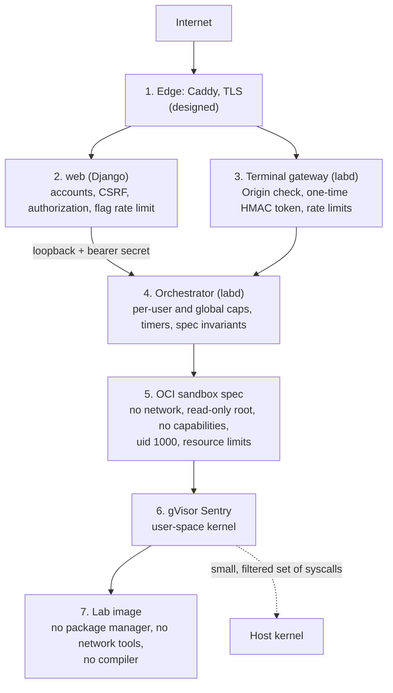

# Security

gdb Challenge Labs gives anyone with an account a Linux shell on the server. That is the whole product, and it is also the main risk. The design assumes every lab is hostile: the person at the keyboard will try to break out, reach the network, starve other labs, or read the flag without solving the bug. No single control is trusted to stop that. Each layer below holds even if the one in front of it fails.

This is a proof of concept and is not deployed anywhere. Everything here is built and tested unless it is marked **designed**: those parts belong to the optional production phase, which I did not build. [Known gaps](#known-gaps) lists them.

## What is protected

| Asset | Threat |
| --- | --- |
| The host and the other labs | Container escape, kernel exploits, reading other labs' files or memory |
| Capacity | One user (or a script) using all the CPU, memory, disk or lab slots |
| Flags | Reading a flag from the binary, the image or the network instead of solving the lab |
| Accounts and sessions | Hijacking another user's terminal, cross-site requests, guessing flags |
| Secrets | The deploy secret behind every flag, the web-to-labd secrets, database passwords |
| What learners type | Every command line is recorded, so it must be disclosed and kept on the server |

## The layers

From the internet inward, a request or a keystroke passes through these layers:

### 1. Edge (designed)

The spec puts Caddy in front of everything. It terminates TLS, routes pages to Django and `/ws/term` to labd, and strips forwarded auth headers. Django's production settings already expect it: `SECURE_PROXY_SSL_HEADER`, secure session and CSRF cookies, HSTS, and `nosniff`. The Caddyfile itself is not written yet.

### 2. The web app

- Login by email through django-allauth. Production settings require email verification.
- Every lab view needs a logged-in user. The admin pages (live sessions, kill, drain, analytics) need a staff account.
- Django's CSRF and clickjacking middleware are on for every form.
- Production settings refuse to start if any secret is missing. There are no defaults to fall back to.
- A user can submit 10 flags per challenge per 10 minutes, which makes guessing a 24-character flag pointless.
- No third-party scripts. xterm.js is vendored into the repo and served from the app's own static files.
- Drag-and-drop into the terminal is disabled. Paste still works, at the gateway's rate limit.

### 3. The boundary between web and labd

The two halves of the app trust each other as little as possible.

- **Only `labd` can reach containerd.** labd runs as a normal user in the `containerd` group, not as root. The web app never has the containerd socket (S10), so a bug in Django cannot start, stop or exec into a container.
- **labd's internal API listens on loopback only.** labd refuses to start if the address is anything else, and every route except `/healthz` needs a bearer secret shared with web (S11).
- **Separate database roles.** `web` and `labd` log in as different Postgres roles. ADR 0003 defines least-privilege grants for production: web can read `sessions` and `samples` but not change them, and can add to `events` but not edit them. Those grants are **designed**; the dev database gives both roles broad rights.

### 4. The terminal gateway

The WebSocket is the one place where a browser talks to labd directly, so it gets its own checks.

- **One-time tokens.** web mints the token only after it checks the Django session cookie and that the lab belongs to that user (ADR 0015). The token is an HMAC-SHA256 over the session id, user id, expiry and a random nonce. It expires after 60 seconds, works once, and only for its own session (S12, ADR 0012). labd's own dev-only token minting is off in the production config.
- **Origin before token.** labd checks the `Origin` header against the site host before it looks at the token. A cross-site page therefore cannot burn a user's single-use token.
- **Rate limits.** Input is capped at 2 KB/s sustained with a 16 KB burst. Output is capped at 256 KB/s, and a client that stalls for 10 seconds is disconnected (S13). A 10 MB paste does nothing harmful.
- **One socket per session.** A second connection replaces the first.
- **Command capture, disclosed.** Every line typed is stored as an event so hints can improve. The lab page says so before you type anything (S19). Terminal output is not stored.

### 5. The orchestrator

- **Caps.** One running lab per user (S14). A global slot semaphore, set to 120 for the target 8 vCPU / 32 GB server after load tests held 150 (ADR 0019). A bounded FIFO queue behind it. Opening 100 tabs gets you the same one lab.
- **Time limits.** Every lab has a hard TTL and an idle timeout, and the user can extend it only once (S17). An abandoned tab costs nothing for long.
- **Nothing leaks across restarts.** On boot, labd lists every container in its namespace and removes any that has no open session row (S18). A crash or a deploy cannot leave orphaned labs running.
- **The spec is checked before every create.** labd builds each container's OCI spec from a fixed base file plus the challenge's limits. Then `CheckInvariants` rejects it if it breaks any sandbox rule below (S2 to S8). A bad manifest or a code change cannot loosen the sandbox without failing here first.
- **No downloads at request time.** Lab images are pulled ahead of time and pinned by `sha256` digest. The manifest schema rejects an image without one (S20).
- **Operator controls.** Staff can kill any lab, and a drain switch stops all new starts without touching running labs (ADR 0018).

### 6. The sandbox spec

Every lab starts from [labd/sandbox/sandbox-base.json](labd/sandbox/sandbox-base.json):

| Control | Setting | What it stops |
| --- | --- | --- |
| Network | Fresh network namespace with no interfaces (S2) | Downloads, reverse shells, sending the flag anywhere |
| Root filesystem | Read-only (S3) | Installing or changing anything |
| Writable space | `/tmp` and `/home/lab` only: tmpfs, 16 MB, `noexec,nosuid,nodev` (S4) | Dropping and running a binary, filling the disk |
| User | uid/gid 1000, `noNewPrivileges` (S5) | Becoming root through setuid binaries |
| Capabilities | All five sets empty (S6) | Every privileged operation. gdb debugging its own child needs none |
| Memory | Limit from the manifest (default 128 MB), no swap (S7) | Memory exhaustion. The OOM killer ends the lab, not the box |
| CPU | Quota from the manifest (default 0.5 core) | A `while true` loop costs half a core at most |
| Processes | `RLIMIT_NPROC` 32 inside gVisor, plus a host cgroup cap (S7, ADR 0009) | Fork bombs, inside the sandbox and on the host |
| Files | `RLIMIT_FSIZE` 32 MB, `RLIMIT_NOFILE` 256, no core dumps | Huge files, descriptor exhaustion |
| Mounts and devices | No host bind mounts, no host `/proc`, no devices beyond the PTY. Sensitive `/proc` paths masked or read-only (S8) | Any view of the host |

### 7. gVisor

Labs run under gVisor's `runsc` runtime, never plain `runc`, in production (S1). gVisor puts a user-space kernel, the Sentry, between the lab and the host. The lab's system calls, including gdb's heavy use of `ptrace`, go to the Sentry and not to the host kernel. A kernel exploit typed into a lab attacks gVisor's kernel. To reach the host it would also need a bug in the Sentry and a way past the small, filtered set of host calls the Sentry itself makes. The production provisioning installs no `runc` at all.

### 8. The image

The shared base image ([images/labbase](images/labbase)) is Alpine with gdb. It has no package manager, no `wget`, `nc`, `telnet`, `ftpget`, `httpd` or other network applets, and no compiler (S9). A test fails the build if any of them come back. gdb's `shell` and `python` commands cannot be removed without a custom gdb build. Inside this sandbox they reach nothing: there is nothing useful to run and nowhere to connect.

### 9. Flags

- **Never stored.** A flag is `LAB{...}` around the first 24 base32 characters of HMAC-SHA256(deploy secret, challenge slug). Nothing in the database or the repo holds a real flag (S15, ADR 0005).
- **Compared in constant time** with `hmac.compare_digest`.
- **Not in the binary.** The build stores the flag XOR-scrambled with a 32-bit key that only the program's correct runtime state produces. With the bug still in place, the program prints garbage. Every challenge build runs `strings` on the binary and fails if the flag shows up. It also proves the lab is solvable by running a scripted gdb solution in the sandbox (S16).
- **One secret per deployment.** Rotating `DEPLOY_SECRET` changes every flag, so leaked write-ups stop working. Go and Python must both reproduce shared test vectors computed with `openssl`.

## How the rules are enforced

[docs/SECURITY-INVARIANTS.md](docs/SECURITY-INVARIANTS.md) lists 20 invariants, S1 to S20, and each one names the test that enforces it. The rule for contributors is that a failing invariant test means the code is wrong. Changing the test needs a written decision record first.

The tests come in four kinds:

- **Golden spec tests** compare the built OCI spec with the expected one, mount by mount.
- **P0 probes** run inside a real gVisor sandbox and try the attacks. `touch /x` must fail. A 20 MB write to `/tmp` must fail. A copied binary made executable must not run. A socket must find no route. `id` must print 1000.
- **Unit tests** cover the gateway (expired, reused, wrong-session and wrong-origin tokens are all rejected), the rate limiters, the caps, and the timers with a fake clock.
- **Shared test vectors**, computed with `openssl` and checked by both the Go and the Python code, cover flags and terminal tokens.

The load tests also act as abuse tests. The P10 run kept 10 % of labs in a busy loop and checked that the other learners still got their keystrokes echoed quickly. At 150 labs, p95 echo latency was 9.7 ms against a 100 ms limit.

## Abuse cases

| Attempt | What happens |
| --- | --- |
| `wget`, `nc`, or a hand-written socket | The tools are not in the image, and a socket has no network to use |
| Fork bomb | Stops at 32 processes. The lab survives or ends; the host is unaffected |
| Fill `/tmp` | The tmpfs is capped at 16 MB and single files at 32 MB |
| Infinite loop | Costs at most half a core. Other labs keep their share |
| Kernel exploit through syscalls or ptrace | Lands in gVisor's Sentry, not the host kernel |
| Open 100 tabs to start 100 labs | One lab per user |
| Paste 10 MB into the terminal | Input rate limit. Excess bytes are dropped with a warning |
| Use someone else's terminal link | The token is bound to its session and user, expires in 60 s, and works once |
| Guess the flag | 10 attempts per 10 minutes against a 120-bit value |

## Known gaps

- **The production layer is designed, not built.** That covers the Caddyfile, systemd units and their hardening, generated production secrets, least-privilege database grants, backups and a host firewall. [docs/plan/phase-8-production.md](docs/plan/phase-8-production.md) has the plan.
- **No Content-Security-Policy header yet.** The app loads no third-party scripts, but a CSP would block injected ones as well.
- **macOS dev runs labs under `runc`.** gdb under gVisor on arm64 cannot resume from a breakpoint, so the Mac's VM uses `runc` (QUESTIONS Q13). That is a development convenience only. The x86-64 reference machine and production use gVisor.
- **gdb keeps its `shell` and `python` commands.** A gdb built `--without-python` would remove the interpreter. The sandbox makes both harmless, but removing them would be one fewer thing to trust.
- **One host, one isolation boundary per lab.** A gVisor escape combined with a host kernel bug would expose the box. Running each lab in a microVM (Firecracker or Kata) is the next step up, at a real cost in memory per lab.
- **No extra seccomp profile on top of gVisor.** This is deliberate. gVisor's own filter is the one that matters, and a second profile would need measurements to justify it.

## Reporting a problem

The project is not running anywhere, so there is no live system at risk. If you see a weakness in the design, please open an issue. I would like to hear about it.
