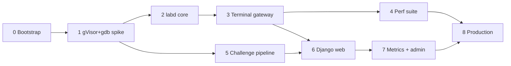

# Implementation plan

This plan turns [the MVP spec](../spec/mvp-spec.md) into nine phases (0–8). Each phase has a document in this directory with numbered tasks, tests, and a gate. The gate is a command, `./run.sh gate --phase N`, that must exit 0 before the next phase starts.

The plan is written so that a less capable model can execute it one phase at a time without re-deriving the design. If a phase document and this file disagree, the phase document wins. If a phase document and the spec disagree, the spec wins unless an ADR says otherwise.

## Why this order

The project exists to answer one question first: **how many gVisor-sandboxed gdb labs fit on an 8 vCPU / 32 GB box, and what does each cost?** Everything that produces a measured answer comes before everything that makes the product pleasant.

1. Phase 1 confirms gdb works under gVisor at all and gives the first per-lab memory number (one lab, idle, `runsc` vs `runc`).
2. Phase 2 gives the create/kill latency and container overhead numbers.
3. Phase 3 gives keystroke round-trip and a full 10-minute single-session profile (P1).
4. Phase 4 gives everything else: capacity at 100, churn, crash recovery, bandwidth, disk (P2–P9). After Phase 4 the capacity table in `docs/metrics/capacity.md` contains no estimates.
5. Phases 5–7 build the product on top of a runtime whose cost is known.
6. Phase 8 puts it on the VPS and adds tiers 2–3.

Phase 5 (challenge pipeline) depends only on Phase 1, so it can run in parallel with Phases 2–4 if two people or two sessions are available. Nothing else is parallel.

## Phase table

| Phase | Document | Deliverable | Gate in one line | Spec milestone |
| --- | --- | --- | --- | --- |
| 0 | [phase-0-bootstrap.md](phase-0-bootstrap.md) | Repo, toolchain, Lima VM with containerd + runsc, empty Go and Django skeletons | `run.sh check`, `test --all`, `vm verify` all green on the Mac and the Linux laptop | — |
| 1 | [phase-1-gvisor-gdb-spike.md](phase-1-gvisor-gdb-spike.md) | `labbase` image, `sandbox-base.json`, perf image, P0 script and report | P0 every row pass or documented fallback; image < 45 MB; first RSS numbers recorded | M1 |
| 2 | [phase-2-labd-core.md](phase-2-labd-core.md) | `labd` session manager: containerd, semaphore, queue, TTLs, reconciler, internal API, store | Go unit tests; integration tests in VM; P4-lite and P5 pass with zero leaked containers | M2 |
| 3 | [phase-3-terminal-gateway.md](phase-3-terminal-gateway.md) | WebSocket ↔ PTY, tokens, rate limits, capture, dev test page | Unit tests; scripted WS gdb session; P1 report; a human debugs in a browser | M3 |
| 4 | [phase-4-perf-suite.md](phase-4-perf-suite.md) | `labd-perf` driver, P1–P9, `perf-report.json`, capacity table replaced | All scenarios produce numbers on an x86-64 box; pass criteria met or failures have decisions | M4 |
| 5 | [phase-5-challenge-pipeline.md](phase-5-challenge-pipeline.md) | Manifest schema, build tooling, flag derivation, 5 tier-1 challenges, `challenges.json`, local build scripts (no CI, ADR 0008) | Every challenge builds reproducibly, passes leak and solve/no-solve checks; `labd pull` works | M5 |
| 6 | [phase-6-web-app.md](phase-6-web-app.md) | Django: accounts, curriculum, lab page with xterm.js, flags, progress, dashboard | Unit tests; end-to-end: sign up, start lab, solve, submit flag, next unlocked | M6 |
| 7 | [phase-7-metrics-admin.md](phase-7-metrics-admin.md) | events/samples emission, rollups, retention, dashboards, admin live view with kill | Rollup tests; admin watches a 20-lab `labd-perf` run live and kills one | M7 |
| 8 | [phase-8-production.md](phase-8-production.md) | Provisioning, Caddy TLS, systemd, backups, hardening, tiers 2–3 (≥ 15 challenges), beta | Production checklist; 20-lab smoke on the VPS; backup restored into VM; 10 beta users | M8 |

## How to execute a phase

Follow this protocol exactly. It is designed to survive context loss between sessions.

1. **Orient.** Read `CLAUDE.md`, `docs/STATUS.md`, this file, and the phase document. Read the spec sections the phase document links to. Do not read the whole spec every time.
2. **Check the gate of the previous phase** by running `./run.sh gate --phase N-1`. If it fails, stop and fix that first; record it in STATUS.md.
3. **Create the branch** `phase-N-<slug>` if it does not exist.
4. **Do the tasks in order.** Each task has a "Done when" line. Run that check. Commit with `[PN] area: what`. Do not skip a task because it looks trivial, and do not combine tasks.
5. **Write the tests the phase lists** as you go, not at the end. A task whose "Done when" is a test is not done until that test runs and passes.
6. **Record numbers.** Any task that measures something writes to `docs/metrics/` in the format the phase document specifies.
7. **Run the gate** `./run.sh gate --phase N`. Paste the last 30 lines of its output into STATUS.md under the phase's log entry.
8. **Update STATUS.md**: phase board row, current phase pointer, log entry with date, what was done, what was hard, what is next. If you stopped mid-phase, say exactly which task is next.
9. **Stop.** Do not start the next phase in the same session unless the owner asked for it.

## Gate rules

- A gate is the command `./run.sh gate --phase N` (implemented in `scripts/gate.sh`). Its checks are listed in each phase document under "Gate". The script and the document must agree; if you change one, change the other.
- All gate checks must pass. "Mostly passing" is failing.
- A perf criterion that fails is not a gate failure by itself **if** the phase document says so and a decision is recorded (for example, lowering `max_sessions`). The gate then checks that the decision file exists.
- A gate never depends on manual steps except where the phase document says "human check"; those are recorded in STATUS.md with the date and the person.
- Nothing labelled `TODO` or `FIXME` may remain inside the files a phase delivers. Deferred work goes into the next phase's document or `docs/QUESTIONS.md`.

## Testing pyramid used throughout

| Layer | Tool | Where it runs | When |
| --- | --- | --- | --- |
| Go unit | `go test ./...` with fakes for containerd, clock, Postgres | host | before every push |
| Go integration | `go test -tags integration` against real containerd + runsc | Lima VM, x86 box | gates 2, 3 |
| Django unit and view | `pytest-django`, SQLite or Postgres | host | before every push |
| Image tests | shell scripts asserting image contents and behaviour | VM | gates 1, 5 |
| Challenge oracle | `gdb -batch` solve/no-solve under runsc, `strings` leak check | VM | gate 5, every challenge change |
| End to end | Playwright against Django + real labd | VM | gate 6, 7 |
| Perf | `labd-perf` scenarios P0–P9 | x86-64 Linux box | gates 1, 3, 4, 8 |

## What "done" means for the MVP

- `docs/metrics/capacity.md` has no row marked *est.*
- `docs/metrics/perf-report-<date>-<host>.json` exists for the production box with all P1–P9 present.
- A new user can sign up, work through tier 1, and see their progress; the admin can watch and kill sessions.
- Tiers 1–3 with at least 15 challenges are imported and enabled.
- The VPS is rebuildable from `deploy/scripts/provision.sh` plus a database restore in under an hour, and that has been done once.
