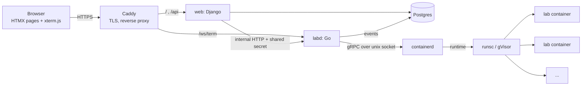
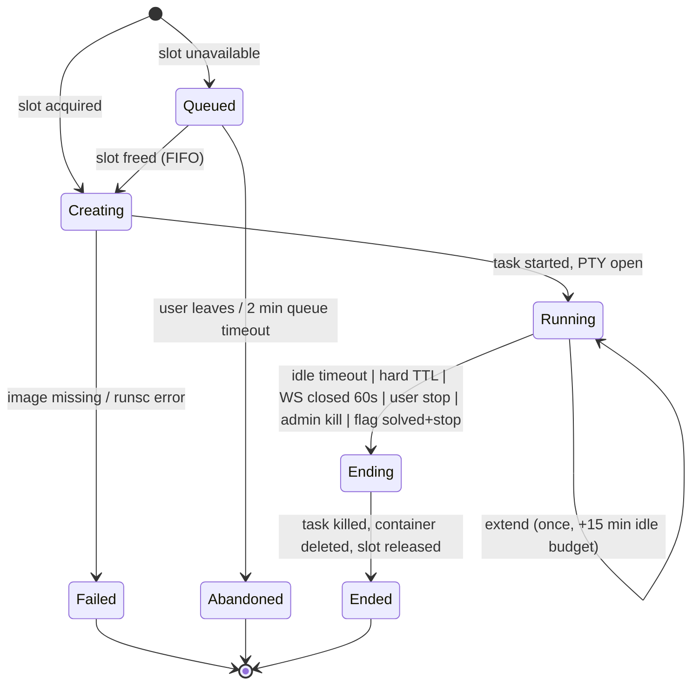

# gdb Challenge Labs — MVP Spec

Sep 26, 2026 · @Odniel

## Overview & goals

The MVP is a single-VPS web platform where a logged-in developer picks a gdb debugging challenge, gets a browser terminal into a sandboxed Alpine container holding a bug, debugs it, and submits a CTF-style flag to progress through a curriculum.

**In scope**

- Landing page, signup/login, curriculum with lessons and challenges, per-user progress
- One-user-per-session labs exposing a shell (busybox ash) with gdb, source, and the target binary
- Flag submission through the web form (never from inside the container)
- Hard cap of 100 concurrent labs, adjustable by config, with a queue when full
- Admin section: challenge management, user management, live session view, kill switch
- Lightweight, homegrown metrics and analytics (no Prometheus, no Grafana)
- Capture of gdb/shell command history per session for analytics and future hints
- Local performance test suite that produces measured per-lab CPU, memory, disk and bandwidth numbers

**Out of scope for MVP**

- Kubernetes or any derivative (k3s, k0s, microk8s)
- Recompiling inside the lab (no compiler in the image)
- Multi-user or pair sessions
- Persistent lab state between sessions
- Multi-node scaling, billing, and non-x86 targets (ARM/Go/Rust tiers come after MVP)

**Success criteria**

| Criterion | Target |
| --- | --- |
| Lab start latency (click to prompt) | p95 < 2 s |
| Terminal keystroke round-trip | p95 < 100 ms on the VPS |
| Concurrent labs on the Hostinger 8 vCPU / 32 GB box | 100 with ≥ 25 % memory headroom (measured, not estimated) |
| Sandbox escape surface | No network, no host mounts, non-root, gVisor, all caps dropped |
| Orphaned containers after crash/restart of the orchestrator | 0 (reconciled on boot) |
| Curriculum at launch | 3 tiers, ≥ 15 challenges |

## Architecture

Four processes on one box: `web` (Django), `labd` (Go orchestrator + terminal gateway), `containerd` + `runsc`, and Postgres. Only `labd` touches the containerd socket; the browser never talks to a container directly.



**Responsibilities**

| Component | Owns | Does not own |
| --- | --- | --- |
| Caddy | TLS, HTTP/2, routing, WebSocket upgrade passthrough | Any auth decision |
| web (Django) | Users, auth, curriculum, progress, flags, admin, analytics pages, issuing session tokens | Container lifecycle |
| labd (Go) | Session lifecycle, concurrency cap and queue, timeouts, PTY bridging, command capture, metrics emission, reconciliation on boot | Curriculum, users, flags |
| containerd + runsc | Running sandboxes from pre-built images | Policy |
| Postgres | All durable state: users, progress, sessions, events, rollups | Nothing ephemeral |

**Start-a-lab flow**

1. User clicks Start on a challenge page.
2. `web` checks entitlement (logged in, challenge unlocked, no active session for this user).
3. `web` calls `POST /internal/sessions` on `labd` with `{user_id, challenge_slug, image_digest}`.
4. `labd` acquires a slot from the semaphore (or returns `429 queued` with position); creates the container from the pinned image; starts the task with a PTY; records `session_id`.
5. `labd` returns `{session_id, ws_token}`; `web` renders the lab page with xterm.js pointed at `wss://host/ws/term/{session_id}?t=<token>`.
6. Browser connects; `labd` validates the token (HMAC, 60 s expiry, single use), attaches the PTY, streams bytes both ways.
7. On disconnect, idle timeout, hard TTL, admin kill, or user Stop: `labd` kills the task, deletes the container, releases the slot, writes `session_ended` with a reason.
8. User submits the flag on the web form; `web` validates and marks progress. The lab can be stopped or kept open independently of the flag.

**Why one Go daemon instead of two**

Splitting orchestrator and gateway adds a hop and a second failure domain for no MVP benefit. Keep them as separate packages inside one binary (`internal/orch`, `internal/term`, `internal/metrics`) so they can be split later if a second node ever appears.

## Lab images

One pinned base image plus a thin layer per challenge, built by CI from a `challenges/` git repo. No image is ever built on the VPS at request time.

**Base image (`labbase`)**

- `alpine:3.20` pinned by digest, then `apk add gdb binutils` and nothing else
- Remove: `apk`, `wget`, `busybox` applets not needed (`nc`, `wget`, `ftpget`, `telnet`, `httpd`, `udhcpc`, `ifconfig`, `route`), all of `/etc/apk`
- Keep busybox applets: `sh`, `ls`, `cat`, `less`, `grep`, `head`, `tail`, `wc`, `hexdump`, `strings`, `file`; plus `objdump`, `readelf`, `nm` from binutils (decision: available in every tier)
- Non-root user `lab` (uid 1000), home `/home/lab`, `PS1` set, `.gdbinit` with `set disable-randomization on`, `set can-use-hw-watchpoints 0`, `set pagination off`, `set confirm off`
- Target size: under 45 MB. Stretch: rebuild gdb without Python (`--without-python`) to drop \~30 MB and the embedded interpreter

**Per-challenge layer**

```
gdb-labs/                      # one monorepo
  labd/                        # Go orchestrator + gateway + perf suite
  web/                         # Django app
  images/
    labbase/Dockerfile         # the shared base image
    build/Dockerfile           # gcc toolchain used only by CI
  challenges/
    schema/manifest.schema.json
    tier1-c-fundamentals/
      01-off-by-one/
        manifest.yaml
        lesson.md              # rendered on the web side
        src/main.c
        build.sh               # exact flags, deterministic
        solve.gdb              # private CI oracle, never copied into the image
        solution.md            # private walkthrough shown after a solve
      02-null-deref/
      03-uninitialized/
      04-unterminated/
      05-stack-overwrite/
    tier2-optimized-c/
    tier3-concurrency/
  deploy/                      # provisioning script, systemd units, Caddyfile
  .github/workflows/
    challenges.yml             # builds + pushes only the challenge dirs that changed
    labbase.yml                # rebuilds the base on Dockerfile change or weekly
```

Each tier folder is `tierN-<slug>/`, each challenge `NN-<slug>/`; the `slug` in the manifest is `tierN-NN-<slug>` and doubles as the image name. CI diffs `challenges/**` against the previous commit and rebuilds only touched challenges; a `labbase` change rebuilds all of them.

`manifest.yaml`:

```yaml
slug: tier1-01-off-by-one
title: Off by one
tier: 1
order: 1
difficulty: 1        # 1-5
estimated_minutes: 15
flag_format: "LAB{...}"   # value is per-deploy: HMAC(deploy_secret, slug), never stored here
image: ghcr.io/<org>/lab-tier1-01-off-by-one@sha256:<digest>   # written by CI
limits:
  memory_mb: 128
  cpu_millicores: 500
  pids: 32
  ttl_minutes: 60
  idle_minutes: 15
  extend_minutes: 15      # one extension per session
hints:
  - cost: 0
    text: "Start with `break main` and `run`."
  - cost: 1
    text: "Watch the loop counter with `display i`."
tags: [c, loops, memory]
```

**Flag mechanism (decision: per-deploy)**: the flag for a challenge is `LAB{base32(HMAC-SHA256(deploy_secret, slug))[:24]}`. At build time CI computes it, XOR-encodes it with a keystream derived from the *correct* runtime state the user must reach (a value, a pointer target, a checksum), and embeds only the encoded blob. The binary decodes and prints it in a `report()` function that is reached only when the bug has been understood and worked around inside gdb (`set var`, `return`, `jump`). Calling `report()` with wrong state prints garbage, so `call report()` and `strings` give nothing. Rotating `deploy_secret` invalidates every leaked writeup; `web` derives the same flag at submission time and stores nothing per challenge. CI verifies with a `strings | grep LAB{` check and a `gdb -batch` run that reproduces the intended solve.

**Build pipeline (GitHub Actions or a local script, both produce identical output)**

1. Lint manifest against a JSON schema.
2. Compute the per-deploy flag from `DEPLOY_SECRET` (a CI secret; the same value lives in `web`'s settings) and generate `flag_blob.h` for the build.
3. Build binary in a build container (`gcc` present there, never in the lab image). Mandatory flags for every tier: `-no-pie -fno-pie` so addresses are stable even if `disable-randomization` ever fails; `SOURCE_DATE_EPOCH` for reproducibility.
4. `strings` check for flag leakage; run the manifest's `solve.gdb` script under `runsc` in batch mode and assert the flag prints; run it again *without* the fix and assert it does not.
5. `FROM labbase` + `COPY` `src/`, binary, `README` → push to a private registry with digest.
6. Write the digest back into `manifest.yaml` and open a PR, or emit a `challenges.json` that `web` imports via a management command.
7. On the VPS, `labd pull` pre-pulls every digest in `challenges.json` so first start is never a cold pull.

**Registry**: GHCR private repo, or `registry:2` running on the VPS behind Caddy with basic auth. GHCR is less to operate; on-box registry keeps the no-cloud rule strictly. Decision: GHCR, private, pulled once and kept locally:

- GitHub Actions builds and pushes `ghcr.io/<org>/lab-<slug>:<git-sha>` and `@sha256:<digest>`; the digest is what `challenges.json` records
- The VPS authenticates with a read-only fine-grained PAT stored in `/etc/labd/ghcr.env` (root:labd 0640); containerd's `hosts.toml` for `ghcr.io` carries it
- `labd pull` runs on `challenges.json` change (deploy) and on `POST /internal/reload`: it pulls every digest not already in the containerd content store, then labels each with `lab.keep=true`
- Local retention: containerd's garbage collector is configured to never collect content or snapshots labeled `lab.keep`; images are removed only by `labd prune`, which deletes digests no longer referenced by any enabled challenge **and** older than 14 days, so a rollback never needs a network pull
- Updates: a new build produces a new digest; the old one stays until pruned; running sessions keep the image they started with
- Outage behavior: if GHCR is unreachable, existing labs start normally; `labd pull` logs and retries with backoff; the admin live page shows "N challenges pending pull" so a broken token is visible within minutes

## Orchestrator (`labd`)

`labd` is a single Go binary using the containerd Go client directly; there is no Docker daemon, no CRI, no scheduler. It is a session manager with a semaphore.

**Session state machine**



**containerd usage**

- Namespace `labs`; snapshotter `overlayfs`; runtime `io.containerd.runsc.v1`
- Container spec built with `oci.WithSpecFromFile(sandbox-base.json)` plus per-challenge limits from the manifest (see Sandbox security profile)
- Task created with `cio.NewCreator(cio.WithTerminal, cio.WithStreams(...))` so the task's stdio *is* a PTY; `labd` holds the fifo ends
- One goroutine per session owns the task; a `context.WithTimeout` enforces hard TTL; an idle timer resets on every input byte
- Container labels: `lab.session_id`, `lab.user_id`, `lab.challenge`, `lab.created_at` so reconciliation needs no external state

**Concurrency cap**

- `max_sessions` in config (default 100); a buffered channel of that size is the semaphore
- Per-user cap: 1 active session; a second start returns the existing session
- Queue: bounded FIFO (default 50) with position reported to the client via the same WebSocket (`{"type":"queued","position":7}`); exceeding the queue returns 503 with a retry-after
- Cap changes at runtime via `SIGHUP` reload of config; lowering it never kills running sessions, it only stops admitting

**Reconciliation on boot**

1. List all containers in namespace `labs`.
2. Any without a matching open row in `sessions` (or older than `ttl_minutes`) is killed and deleted; the row (if present) is closed with reason `reconciled`.
3. Any with a live task and an open row is re-adopted: PTY re-attached to fresh fifos so a returning browser can reconnect within the WS grace window.

This makes `labd` safe to restart on deploy without leaking containers.

**Internal HTTP API (loopback only, bearer secret shared with `web`)**

| Method | Path | Purpose |
| --- | --- | --- |
| POST | `/internal/sessions` | Start (or return existing) session for `{user_id, challenge_slug}` → `{session_id, ws_token, state, queue_position}` |
| DELETE | `/internal/sessions/{id}` | Stop with reason `user_stop` or `admin_kill` |
| GET | `/internal/sessions` | Live list for the admin page |
| GET | `/internal/stats` | Active, queued, slots free, host memory/CPU, per-session RSS |
| POST | `/internal/reload` | Re-read config and `challenges.json`, pre-pull new digests |
| GET | `/healthz` | Liveness for Caddy/systemd |

**Config (`labd.yaml`)**

```yaml
listen_internal: 127.0.0.1:8081
listen_ws: 127.0.0.1:8082
containerd_socket: /run/containerd/containerd.sock
runtime: io.containerd.runsc.v1
max_sessions: 100
max_queue: 50
ws_reconnect_grace_s: 60
default_limits: {memory_mb: 128, cpu_millicores: 500, pids: 32, ttl_minutes: 60, idle_minutes: 15, extend_minutes: 15}
challenges_file: /etc/labd/challenges.json
postgres_dsn: postgres://labd@localhost/labs
metrics_flush_s: 10
```

## Sandbox security profile

Every lab runs under gVisor with no network, a read-only rootfs, no capabilities, and hard resource limits. A shell is exposed, so the goal is that nothing useful can be reached from it, not that nothing can be typed.

| Control | Setting | Why |
| --- | --- | --- |
| Runtime | `runsc` (gVisor), platform `systrap` | User-space kernel between ptrace-heavy gdb and the host kernel |
| Network | No network namespace joined to anything; no `lo` needed | Flags leave via the web form, never the container |
| Root filesystem | Read-only overlay; image already stripped of `apk`, `wget`, network applets | Nothing to install, nothing to download |
| Writable space | `tmpfs` on `/tmp` and `/home/lab` (size 16 MB, `noexec,nosuid,nodev`) | gdb needs scratch; no persistence, no dropping executables |
| User | uid/gid 1000, no sudo, `no_new_privs` | Non-root inside and, under gVisor, non-root on host too |
| Capabilities | All dropped, none added | gdb attaching to a child it spawned needs no `CAP_SYS_PTRACE` |
| Seccomp | gVisor's own filter is the effective one; keep runsc defaults | Adding an OCI seccomp profile on top adds little under gVisor |
| Memory | cgroup limit from manifest (default 128 MB), no swap | OOM kills the lab, not the box |
| CPU | `cpu_millicores` quota (default 500) | Infinite loops in the debuggee stay cheap |
| PIDs | 32 | Caps fork bombs from `shell` or the debuggee |
| File size / open files | `RLIMIT_FSIZE` 32 MB, `RLIMIT_NOFILE` 256 | Bounds tmpfs abuse |
| Time | Hard TTL and idle timeout from manifest | Bounds cost of abandoned tabs |
| Kernel/host | Host `sysctl kernel.yama.ptrace_scope=1` is irrelevant inside gVisor; keep host default | gVisor implements its own ptrace |
| Mounts | No host bind mounts, no `/proc` of host, no devices beyond the PTY | Zero host surface |

**gdb-specific notes**

- gdb's `shell`, `!`, `pipe`, and `python` commands cannot be disabled at runtime without a custom build. Mitigation is the image (nothing to run) and the sandbox (nowhere to go). A `--without-python` gdb build removes the interpreter entirely and is a stretch goal.
- **ASLR off is a hard requirement for early tiers** (decision). Two independent mechanisms, both applied: (1) every challenge binary is built `-no-pie`, so code and data addresses are fixed regardless of the runtime; (2) `.gdbinit` sets `disable-randomization on`, which calls `personality(ADDR_NO_RANDOMIZE)` and gVisor supports it. P0 in the perf suite asserts that `&main` is identical across three runs both inside gdb and when run directly; the build is rejected if not.
- Hardware watchpoints depend on debug registers that gVisor may not expose. Decision: `.gdbinit` sets `can-use-hw-watchpoints 0` so behavior is identical on every box; software watchpoints are slower but predictable, and early challenges keep watched loops short. If P0 shows hardware watchpoints work under `systrap`, this can be relaxed per tier.
- Core dumps: if a tier uses `core` files, ship the core in the image rather than relying on `ulimit -c` inside the sandbox.

**Abuse cases and expected outcome**

| Attempt | Outcome |
| --- | --- |
| `wget evil` / `nc` | Applet absent; even a hand-rolled socket has no network |
| `:(){ :\|:& };:` | pids limit hit at 32; session continues or is killed by OOM/PID exhaustion |
| Fill `/tmp` | tmpfs 16 MB cap; `RLIMIT_FSIZE` stops single large writes |
| `while true; do :; done` | CPU quota; costs at most 0.5 core |
| Kernel exploit via ptrace/syscall fuzzing | Hits gVisor's Sentry, not the host kernel |
| Open 100 tabs to start 100 labs | Per-user cap of 1 active session |
| Paste 10 MB into the terminal | Gateway input rate limit (see Terminal gateway) |

## Terminal gateway

The gateway is the `internal/term` package in `labd`: one WebSocket per session, bridged to the container task's PTY, with auth, rate limits, resize, and command capture.

**Protocol** (binary frames for terminal bytes, JSON text frames for control)

| Direction | Frame | Meaning |
| --- | --- | --- |
| client → server | binary | Raw keystrokes to the PTY |
| client → server | `{"type":"resize","cols":120,"rows":40}` | Forwarded as `task.Resize` |
| client → server | `{"type":"extend"}` | Adds `extend_minutes` to the idle budget; accepted once per session, then answered with `{"type":"extend","ok":false}` |
| client → server | `{"type":"ping"}` | Keeps the socket open; pings alone do not reset the idle timer |
| server → client | binary | PTY output |
| server → client | `{"type":"queued","position":n}` | While waiting for a slot |
| server → client | `{"type":"state","state":"running"\|"ended","reason":"..."}` | Lifecycle |
| server → client | `{"type":"ttl","idle_remaining_s":n,"hard_remaining_s":n,"extend_available":true}` | Every 30 s; the UI shows a countdown and an Extend button at 2 min remaining |

**Auth**

- `ws_token` = HMAC-SHA256 over `session_id|user_id|exp` with a key shared between `web` and `labd`; 60 s expiry; consumed on first use
- Reconnect within `ws_reconnect_grace_s` (60 s) uses a fresh token fetched from `web` (`GET /labs/{session}/token`), which re-checks the Django session cookie
- Origin header must match the site host; Caddy strips any forwarded auth headers

**Rate limits**

- Input: token bucket 2 KB/s sustained, 16 KB burst per session; excess bytes dropped and a `{"type":"warn"}` sent
- Output: 256 KB/s per session, backpressure via a bounded channel; if the client can't keep up for 10 s, the connection is closed (the session stays alive for the grace window)
- Connections: 1 WebSocket per session; a second connection replaces the first

**Command capture**

- The gateway watches the input stream for newline-terminated lines and records them as `command_entered` events with a monotonic sequence number and timestamp
- Decision: every command line is kept (no per-session cap) for the 90-day raw retention; revisit if `events` volume becomes a problem
- This captures what was typed, not what gdb interpreted; good enough for stuck-point analysis and later hint triggers
- Raw output is not stored in MVP (volume and privacy); only line counts per minute
- Disclosed in the Terms and shown once in the lab UI ("Commands are recorded to improve hints")

**Client**

- xterm.js with `@xterm/addon-fit`, `addon-attach` replaced by a small custom handler for the JSON frames
- Lab page layout: terminal left, tabs right for lesson, source (read-only, rendered server-side with line numbers), hints, flag form
- Copy/paste allowed; drag-and-drop disabled

## Web app (Django)

Django 5 with server-rendered templates and HTMX; the only JavaScript-heavy page is the lab terminal. Django admin covers most of the admin section; a few custom views add live session control.

**Apps**

| App | Responsibility |
| --- | --- |
| `accounts` | Signup, login, email verification, password reset (django-allauth or built-in) |
| `curriculum` | Tiers, lessons, challenges imported from `challenges.json`; lesson markdown rendered with a safe renderer |
| `labs` | Start/stop views, session token endpoint, lab page, proxy to `labd` internal API |
| `progress` | Flag submission, attempts, unlocks, hints taken |
| `analytics` | Rollup queries and admin dashboards (see Metrics & analytics) |
| `adminpanel` | Live sessions list with kill button, capacity gauge, challenge enable/disable, feature flags |

**Pages**

- `/` landing; `/login`, `/signup`
- `/learn` curriculum map: tiers → lessons → challenges, with locked/unlocked/solved state
- `/learn/<tier>/<lesson>` lesson content
- `/lab/<slug>` challenge page: description, Start button, hints, flag form, past attempts
- `/lab/<slug>/session` the terminal page (only while a session is running)
- `/dashboard` user progress, streaks, time spent, tier completion
- `/admin/` Django admin; `/admin/live` custom live view

**Flag submission rules**

- Expected flag is computed on the fly: `LAB{base32(HMAC-SHA256(settings.DEPLOY_SECRET, slug))[:24]}`; compare with constant-time equality after trimming whitespace
- Rate limit: 10 attempts per challenge per 10 minutes per user; each attempt recorded
- Solving unlocks the next challenge in the tier; the last challenge in a tier unlocks the next tier
- Decision: all tiers are free; no billing in MVP, so `progress` unlock rules are purely sequential
- Hints with `cost > 0` are recorded and shown on the dashboard; no scoring penalty in MVP, just visibility

**Django ↔ labd contract**

- `web` never blocks on container creation longer than 3 s; if `labd` reports `queued`, the terminal page opens and shows the queue position via WebSocket
- A `sessions` row is created by `labd`, not `web`; `web` reads it. One writer per table avoids races

**Auth on the lab page**: the page itself requires the Django session; the WebSocket requires the HMAC token; both are required so a leaked token alone is useless after 60 s and a session cookie alone can't open someone else's PTY.

## Metrics & analytics

No Prometheus. `labd` and `web` append rows to two Postgres tables, a cron rollup summarizes them, and Django renders the dashboards. Total code: a few hundred lines.

**Two kinds of data**

| Kind | Source | Table | Retention |
| --- | --- | --- | --- |
| Product events (append-only facts) | `web` and `labd` | `events` | Raw 90 days, rollups forever |
| Resource samples (periodic gauges) | `labd` every `metrics_flush_s` | `samples` | Raw 7 days, 1-min rollups 90 days, hourly forever |

**Event schema** (`events`): `id`, `ts`, `type`, `user_id`, `session_id`, `challenge_slug`, `data jsonb`

Event types for MVP:

- `user_signed_up`, `user_logged_in`
- `lab_requested`, `lab_queued`, `lab_started` (data: `start_latency_ms`), `lab_ended` (data: `reason`, `duration_s`, `commands`)
- `command_entered` (data: `seq`, `line`)
- `hint_viewed` (data: `index`, `cost`)
- `flag_submitted` (data: `correct`, `attempt_no`)
- `challenge_solved` (data: `time_to_solve_s`, `hints_used`, `sessions_used`)

**Sample schema** (`samples`): `ts`, `session_id nullable`, `metric`, `value`

Metrics: `host.mem_used_mb`, `host.cpu_pct`, `host.disk_used_gb`, `labd.active`, `labd.queued`, `session.rss_mb` (from the container cgroup), `session.cpu_ms` (delta), `ws.bytes_in`, `ws.bytes_out`. Per-session samples are written in one batched insert per flush.

**How labd collects**: read `memory.current` and `cpu.stat` from each session's cgroup path (containerd creates `/sys/fs/cgroup/labs/<id>/`), plus `/proc/meminfo` and `/proc/stat` for the host. No agent, no exporter.

**Dashboards (Django views, HTMX auto-refresh every 30 s)**

- Live: active/queued/capacity gauge, per-session RSS and age, kill buttons
- Usage: labs per day, unique users per day, median session length, p50/p95 start latency
- Learning: funnel per tier (started → solved), median time-to-solve per challenge, hint usage, most common commands in the 5 minutes before abandonment
- Capacity: memory per active lab over time; peak concurrency per day; this is what tells you when to raise `max_sessions`

**Rollup**: a Django management command run by systemd timer every minute writes `rollups_1m`, hourly `rollups_1h`; a daily job deletes raw rows past retention. Charts render with a small inline SVG helper or Chart.js from a vendored file (no CDN).

## Data model

Postgres 16, one database, two roles: `web` (owns users/curriculum/progress) and `labd` (owns sessions/events/samples, read-only on users).

| Table | Key columns | Writer |
| --- | --- | --- |
| `users` | id, email, password\_hash, created\_at, is\_staff | web |
| `tiers` | id, slug, title, order | web (import) |
| `lessons` | id, tier\_id, slug, title, body\_md, order | web (import) |
| `challenges` | id, tier\_id, slug, title, difficulty, order, image\_digest, limits jsonb, hints jsonb, enabled | web (import) |
| `progress` | user\_id, challenge\_id, state (locked/unlocked/solved), solved\_at, hints\_used, attempts | web |
| `flag_attempts` | id, user\_id, challenge\_id, ts, correct | web |
| `sessions` | id (uuid), user\_id, challenge\_id, state, created\_at, started\_at, ended\_at, end\_reason, container\_id, peak\_rss\_mb, commands | labd |
| `events` | id, ts, type, user\_id, session\_id, challenge\_slug, data jsonb | web, labd |
| `samples` | ts, session\_id nullable, metric, value | labd |
| `rollups_1m`, `rollups_1h` | bucket\_ts, metric, dims jsonb, count, sum, min, max, p50, p95 | web (cron) |

Indexes: `events(ts)`, `events(type, ts)`, `events(session_id)`, `samples(ts)`, `samples(session_id, metric, ts)`, `sessions(user_id, state)`. `events` and `samples` are partitioned by month once volume warrants it; not in MVP.

## Curriculum ladder

MVP ships tiers 1–3 (C, x86-64, \~15 challenges). Tiers 4–8 are the post-MVP roadmap and mostly change the build container and base image, not the platform.

| Tier | Theme | Build flags (all tiers also `-no-pie`) | Sample challenges | Platform impact |
| --- | --- | --- | --- | --- |
| 1 | gdb fundamentals on plain C with full symbols | `-O0 -g` | Off-by-one, null deref, uninitialized read, string termination, stack overwrite | None |
| 2 | Optimized and partially stripped C | `-O2 -g` then selective `strip` | Inlined function crash, variable optimized out, tail-call confusion, heap corruption via `malloc` misuse | None |
| 3 | Concurrency and signals | `-O1 -g -pthread` | Data race, deadlock (two mutexes), signal handler reentrancy, `pthread` join order | None (gVisor threads verified in test suite) |
| 4 | Fully stripped binaries and core dumps | `-O2 -s` | Reverse a stripped crash, analyze a shipped core file, find the flag via disassembly | None (`objdump`/`readelf` already in base) |
| 5 | C++ and object-oriented | `-O1 -g -std=c++20` | Virtual dispatch bug, iterator invalidation, exception unwinding, `std::string` internals | libstdc++ in image (+\~2 MB) |
| 6 | ARM64 | cross-compile, run under `qemu-aarch64` | Same bug classes on aarch64; calling convention differences | `gdb-multiarch` + qemu-user in a separate base image |
| 7 | Go | `go build -gcflags=all="-N -l"` | Goroutine leak, nil map write, defer ordering | Go runtime in gdb needs `runtime-gdb.py`; consider Delve tier instead |
| 8 | Rust | `cargo build` with `debug = true` | Unwrap panic, `unsafe` UB, lifetime-related use-after-free in FFI | `rust-gdb` wrapper and pretty-printers in image |

Each tier ends with a "boss" challenge that combines two earlier bug classes and has no hints.

## First five lessons and labs

Tier 1 is five lessons, each paired with one lab, all plain C built with `gcc -O0 -g -no-pie -fno-stack-protector`. Every lab has the same shape: a small program (< 120 lines) with one bug, a `report()` function that decodes the flag only from correct state, and a path to that state that requires gdb rather than a code edit. Lab 5 is the tier boss and has no hints.

| # | Lesson | gdb concepts taught | Lab | The bug | What must be true when `report()` runs | Intended gdb path |
| --- | --- | --- | --- | --- | --- | --- |
| 1 | Meet gdb: run, break, step, look | `break`, `run`, `next`, `step`, `continue`, `print`, `display`, `list`, `info locals`, `set var` | `01-off-by-one` — `sum_scores()` loops `i <= n` over a 5-element array; the extra read pulls a garbage int and the total is wrong | `total` equals the true sum of the five scores; `report()` XOR-decodes the flag with `total` as key | Break in the loop, `display i`, notice `i == 5`, `print scores[0]@5`, compute the sum with `print`, `set var total = <sum>` after the loop, `continue` |  |
| 2 | Crashes and the stack | `bt`, `frame`, `up`/`down`, `info frame`, `info args`, `print ptr->field`, conditional breakpoints (`break f if x == 3`), `return` | `02-null-deref` — `find_user("Bob")` does a case-sensitive compare against `"bob"`, returns `NULL`, and `greet(u)` dereferences it (SIGSEGV) | `greet()` receives a pointer to the real Bob record; `report()` decodes with `u->id` | Run to the crash, `bt` to find the frame, `up` into `find_user`, break on the compare with a condition, see the mismatch, `finish` then `set var u = &users[2]`, `continue` |  |
| 3 | State you didn't set: uninitialized memory | `watch`, `rwatch`, `info watchpoints`, `x/4dw &var`, `ptype`, `whatis`, `until` | `03-uninitialized` — `int found;` is never assigned in the no-match branch; whatever is on the stack decides whether `apply_discount()` runs | `found == 0` when the branch executes; `report()` decodes with the final `price` | `watch found` before the search, watch it never trigger in the miss case, `x/dw &found` to see stack garbage, `set var found = 0`, `continue` |  |
| 4 | Bytes, strings, and memory | `x/s`, `x/16xb`, `x/8c`, `p/x`, `p/c`, `sizeof` in expressions, `info registers rip rsp`, `set {char}addr = 0` | `04-unterminated` — `strncpy(name, input, 8)` with an 8-char input leaves no NUL; `strlen(name)` runs into the adjacent `role` field and the built key is wrong | `name` is exactly 8 bytes followed by a NUL byte; `report()` decodes with `strlen(name)` and the first 8 bytes | `x/16xb name` to see the missing terminator, `x/s name` to see the run-on, `set {char}(name+8) = 0` (or `set var role[0] = 0`), `continue` |  |
| 5 | Boss: the overwritten neighbor | Everything above plus `watch` on a corrupted variable to catch the write, `info symbol`, `x/32xw $rsp`, `jump`, reading a `struct` layout with `ptype /o` | `05-stack-overwrite` — `memcpy(buf, packet, len)` with a 20-byte packet into `char buf[16]` overwrites the adjacent `unsigned checksum`; validation then fails and `report()` is never reached | `checksum` equals the value computed *before* the copy; `report()` decodes with `checksum` | `watch checksum` to catch the overwrite inside `memcpy`, `bt` to see who did it, `ptype /o struct frame` to see the layout, break before the copy, `print checksum`, let the copy run, `set var checksum = <saved>`, `continue` (or `jump` past the copy) |  |

**Design rules these five follow**

- One bug per lab; the bug is visible from a plain `run` (wrong output or a crash), so the user always has a starting symptom
- The fix is a runtime state change in gdb, never a source edit, because there is no compiler
- Brute force from the shell is not possible: `report()` decodes against runtime state that only exists mid-execution
- Each lab's `solve.gdb` (private) is the CI oracle and the source of the walkthrough shown after a solve
- Hints escalate: hint 1 names the gdb command to try, hint 2 names the variable to look at, hint 3 names the fix; the boss has none

**Lesson content (each \~10 min read, rendered from `lesson.md`)**

1. What a debugger does; compiling with `-g`; the gdb prompt; `run`, `break`, `next` vs `step`, `print`, `display`, `list`; reading a `SIGSEGV` message
2. Stack frames; why `bt` is the first command after a crash; moving between frames; conditional breakpoints; `finish` and `return`
3. Stack memory is reused; what "uninitialized" means physically; watchpoints and their cost; `x` examine syntax
4. Strings are bytes plus a promise; NUL termination; `x/s` vs `x/xb`; struct layout and adjacency; writing memory with `set`
5. Putting it together: forming a hypothesis, catching the write with a watchpoint, confirming with `bt`, choosing the least invasive fix

## Local performance test suite

The suite runs on a local Linux VM sized like the Hostinger plan (8 vCPU, 32 GB) and produces a `perf-report.json` that replaces every estimate in this spec with a measured number. It lives in `labd/perf/` and drives `labd` through its real internal API and WebSocket, so the numbers include the gateway.

**Environment**

- Ubuntu 24.04 VM (Lima, UTM, or a spare box) with containerd 2.x and `runsc` installed; same install script as production
- Kernel and cgroup v2 identical to the VPS image (verify `uname -r` and `stat -fc %T /sys/fs/cgroup`)
- A `perf` challenge image: tier-1 program plus a scripted `gdb` session file (`session.gdb`) that reproduces a realistic 10-minute workflow

**Load driver (`labd-perf`, Go)**

- Opens N sessions with a configurable ramp (e.g. 5/s), each running one of three scripted user profiles over a real WebSocket:
  - `reader`: 2 commands/min, mostly `list`, `info locals`, `bt`; 30 % of wall time idle
  - `stepper`: 20 commands/min, `next`/`step`/`print` loops, 1 `watch` on a variable
  - `abuser`: `while :; do :; done`, fork attempts up to the pid limit, 20 MB write to `/tmp`, 100 KB paste
- Records per session: create-to-prompt latency, per-command echo latency, bytes in/out
- Reads `GET /internal/stats` every 5 s and the raw `samples` table afterwards

**Scenarios**

| ID | Scenario | Pass criteria |
| --- | --- | --- |
| P0 | gdb feature check under runsc: breakpoints, `watch` (hw and sw), `disable-randomization`, threads, `signal`, core load | Every feature listed works or has a documented fallback in `.gdbinit` |
| P1 | Single-session baseline, 10 min `stepper` | RSS and CPU per lab recorded; start latency p95 < 2 s |
| P2 | Ramp to 100 `reader` sessions, hold 20 min | Host memory used < 24 GB; no OOM kills; p95 keystroke echo < 100 ms |
| P3 | 100 mixed: 60 reader / 30 stepper / 10 abuser, hold 20 min | Same as P2; abuser sessions capped by limits with zero effect on others' p95 |
| P4 | Churn: 100 slots, sessions ending and starting every 5 s for 30 min | No container leak (`ctr -n labs c ls` count == active); start latency stable |
| P5 | Crash recovery: `kill -9 labd` at 100 active, restart | All containers reconciled in < 15 s; reconnecting clients within grace window resume |
| P6 | Overload: 150 requests against cap 100 | 50 queued with correct positions; none admitted over cap; queue drains FIFO |
| P7 | Image cold start: flush containerd content store, start 10 labs | Time to first prompt with pull vs. pre-pulled; confirms pre-pull is required |
| P8 | Bandwidth: 100 `stepper` sessions, measure Caddy egress | Bytes/s per session and aggregate; feeds the bandwidth row below |
| P9 | Disk: run P4 for 2 h | Overlay snapshot growth, log growth, `events`/`samples` row counts and table size |

**Outputs (`perf-report.json`)**

```json
{
  "per_lab": {"rss_mb": {"p50": 0, "p95": 0, "max": 0}, "cpu_pct_avg": 0, "disk_mb": 0, "ws_bps_in": 0, "ws_bps_out": 0},
  "host_at_100": {"mem_used_mb": 0, "cpu_pct": 0, "start_latency_ms": {"p50": 0, "p95": 0}, "echo_latency_ms": {"p50": 0, "p95": 0}},
  "gvisor_overhead": {"sentry_rss_mb": 0, "step_cmd_ms_runc": 0, "step_cmd_ms_runsc": 0},
  "leaks": {"containers": 0, "goroutines": 0, "fifos": 0},
  "derived": {"max_sessions_at_25pct_headroom": 0}
}
```

**Also run once for reference**: P1–P3 with `runc` instead of `runsc`. The delta is the price of gVisor; if it turns out to be under \~40 MB and under 2× on `step`, the decision is settled and the number goes in the capacity section.

**Unit and integration tests (Go, run in CI)**

- Semaphore and queue ordering, per-user cap, config reload lowering the cap mid-run
- Token HMAC: expiry, single use, wrong session id, wrong origin
- Rate limiter drop behavior and warn frame
- Command capture splits on newline and ignores control sequences
- Reconciler against a fake containerd client: orphan, adopt, expired-TTL cases
- Sandbox spec snapshot test: the generated OCI spec must match a golden file (no caps, no network, read-only rootfs), so a refactor can't silently loosen it

## Deployment on the Hostinger VPS

One Ubuntu 24.04 KVM VPS (8 vCPU, 32 GB, 400 GB NVMe), everything as systemd units, provisioned by a single idempotent script so a rebuild is one command. First check on the box: `grep -c vmx /proc/cpuinfo` and `ls /dev/kvm`; if KVM is exposed, `runsc --platform=kvm` is worth benchmarking against `systrap`.

**Host hardening**

- SSH key-only, non-standard port, `fail2ban`; `ufw` allowing 22, 80, 443 only
- Unattended security upgrades; kernel updates applied on a weekly maintenance window with a drain (`max_sessions: 0`, wait, reboot)
- Separate unprivileged users: `web`, `labd` (member of a `containerd` group with socket access), `postgres`
- containerd config: `labs` namespace only reachable by `labd`; `runsc` as the only registered runtime for that namespace; `runc` not registered at all in production
- No Docker installed

**Services**

| Unit | Runs | Notes |
| --- | --- | --- |
| `caddy.service` | Caddy 2 | Automatic TLS via Let's Encrypt; `reverse_proxy` to `web` and `labd`; WebSocket passthrough; `request_body max_size 1MB` |
| `web.service` | gunicorn, 4 workers | Unix socket to Caddy; `collectstatic` at deploy |
| `labd.service` | labd | `Restart=always`, `LimitNOFILE=65536`, `After=containerd.service` |
| `containerd.service` | containerd 2.x | cgroup v2, systemd cgroup driver |
| `postgres.service` | Postgres 16 | Local only; `shared_buffers` 2 GB |
| `rollup.timer` | Django management command | Every minute |
| `backup.timer` | `pg_dump` + `restic` to an off-box target | Nightly; the challenge repo is already in git, so DB is the only state |

**Deploy**: `git pull` on the box, `make deploy` builds `labd`, runs migrations, restarts `web` and `labd`. `labd` restart is safe because of reconciliation. Blue/green is unnecessary at this scale.

**Backups and restore**: nightly `pg_dump` to a second provider's object storage or a home NAS via `restic`; a quarterly restore drill into a local VM is part of the perf suite's environment anyway.

## Capacity estimates

These are working assumptions until the perf suite's P2/P3/P8/P9 runs replace them. Every figure marked *est.* is approximate.

| Resource | Per lab (est.) | At 100 labs (est.) | Box has | Headroom |
| --- | --- | --- | --- | --- |
| Memory | 60–80 MB gdb + debuggee, plus 30–50 MB gVisor Sentry → \~130 MB | \~13 GB, plus \~3 GB for web/postgres/containerd/OS | 32 GB | \~50 % |
| CPU | < 1 % idle, 5–20 % of a core during `step` loops | \~1–2 cores average, 4 cores bursty | 8 vCPU | \~50 % |
| Disk (images) | Shared base \~40 MB; per-challenge layer < 1 MB | < 500 MB for 200 challenges | 400 GB | n/a |
| Disk (snapshots) | \~1 MB writable overlay per session (tmpfs holds scratch) | \~100 MB | 400 GB | n/a |
| Disk (data) | `events` + `samples` ≈ 2–4 KB per session-minute | \~10 GB/year at 100 labs busy 8 h/day | 400 GB | years |
| Bandwidth | 0.5–5 KB/s per active terminal | < 1 Mbps aggregate; < 300 GB/month | 32 TB/month | > 100× |

If P2 confirms \~130 MB per lab, the same box supports \~180 labs at 25 % memory headroom; `max_sessions` becomes a dial, not an architecture change.

## Build plan

Eight milestones, each ending in something runnable; M1 is deliberately first because it de-risks the only real unknown.

| # | Milestone | Deliverable | Exit test |
| --- | --- | --- | --- |
| M1 | gVisor + gdb spike | `labbase` image, `sandbox-base.json`, a script that runs a scripted gdb session under `runsc` | P0 passes (or fallbacks documented) |
| M2 | `labd` core | Create/attach/kill sessions via containerd; semaphore; TTLs; reconciler | Go tests + P4/P5 pass |
| M3 | Terminal gateway | WebSocket ↔ PTY, tokens, rate limits, command capture; a bare HTML test page | P1 passes; manual gdb session in browser |
| M4 | Perf suite | `labd-perf` driver, scenarios P1–P9, `perf-report.json` | Capacity table replaced with measured numbers |
| M5 | Challenge pipeline | `challenges/` repo, schema, build script, 5 tier-1 challenges, `challenges.json` import | CI builds, pushes, and imports end to end |
| M6 | Django app | Accounts, curriculum, lab page with xterm.js, flags, progress, dashboard | A user can sign up and solve tier 1 |
| M7 | Metrics + admin | events/samples, rollups, admin live view, kill switch | Admin can watch a 20-lab test run live |
| M8 | Production | Hostinger provisioning script, Caddy TLS, backups, tiers 1–3 content (≥ 15 challenges) | Private beta with 10 users |

Rough effort for one person working evenings: M1 one weekend, M2–M3 two to three weeks, M4 one week, M5–M7 three to four weeks, M8 one week plus content writing in parallel.

## Open questions & risks

**Risks**

| Risk | Likelihood | Mitigation (adopted) | Applied in |
| --- | --- | --- | --- |
| ASLR not reliably disabled under gVisor; early labs depend on stable addresses | Medium | `-no-pie` on every build **and** `disable-randomization on` in `.gdbinit`; P0 asserts `&main` is stable across runs | Lab images, Sandbox profile, Perf suite P0 |
| Hardware watchpoints unavailable under gVisor | Medium | `can-use-hw-watchpoints 0` in `.gdbinit`; software watchpoints everywhere; challenges keep watched regions small | Lab images, Sandbox profile |
| Hostinger KVM guest lacks nested virt so `runsc --platform=kvm` is unavailable | High | `systrap` is the planned platform; KVM only benchmarked if `/dev/kvm` exists | Deployment |
| gVisor per-sandbox overhead higher than estimated | Low–Medium | P2 measures it; `max_sessions` is a config dial; `--without-python` gdb build queued as the first optimization | Perf suite, Orchestrator config |
| Zombie session blocks a user after a closed tab | Medium | 60 s WS grace, 15 min idle timeout with one 15 min extension, Stop button always visible, admin kill | Orchestrator, Gateway, Web |
| Flag leaks via `strings`, `objdump`, or public writeups | Medium | Per-deploy HMAC flags XOR-encoded against correct runtime state; CI leak and solve/no-solve checks; rotating `DEPLOY_SECRET` retires all writeups | Lab images, Web |
| Single box = single point of failure | Certain | Nightly `pg_dump` + `restic` off-box; idempotent provisioning script; rebuild target < 1 h; drill quarterly | Deployment |

**Open questions**

- [x] `Registry: GHCR, private, with local retention on the VPS (decided)`
- [x] Flags are per-deploy (HMAC of slug)
- [x] Idle timeout 15 min with one 15 min extension per session
- [x] All tiers free; billing is not an MVP concern
- [x] `objdump`/`readelf`/`nm` available in every tier
- [x] Command capture keeps every line
- [ ] Email provider for verification and password reset: deferred until M6
